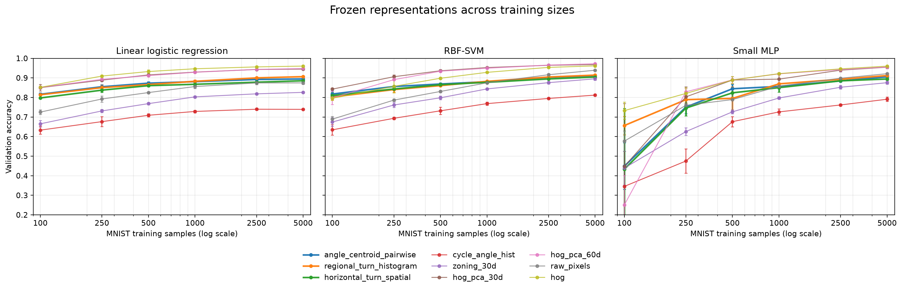

# V3.1 Bias Evaluation

Protocol SHA-256: `64a0fe73d9c4454f9b8fcc9fd62dd0994ff9aff967168ebf9097736bcf33586b`.

## Research question and protocol

This study evaluates the frozen V3 finalists across representation, learner, training size, and domain. It does not search for new biases. A score belongs to a representation–probe pair; it is not an absolute measure of information retained.

The predeclared questions are:

1. Does V3 improve low-data sample efficiency over dimension-matched controls?
2. Does nonlinear probing recover information unavailable to the linear probe?
3. Does V3 add predictive information beyond HOG?
4. Is the proposed mechanism specifically supported by targeted counterfactuals?
5. Does the bias transfer preferentially to related domains?

## Answers to the predeclared questions

1. **Sample efficiency:** The three core V3 finalists improve mean linear AULC over `zoning_30d` by +0.3299 to +0.3889 AULC units across 100–5,000 samples, but trail their width-matched HOG-PCA controls by -0.2262 to -0.1692 AULC units. They beat the simple compact control, while HOG-PCA is more sample-efficient under this probe.
2. **Learner dependence:** Mean nonlinear-minus-linear gain across the three core V3 candidates is RBF -0.16 pp at 500 and +1.45 pp at 5,000; MLP -4.53 pp and +0.86 pp. Among the three core V3 candidates, `angle_centroid_pairwise` leads at 500 and `regional_turn_histogram` leads at 5,000 for all probes. The fixed learner and sample size change measured rankings; nonlinear gains are modest at 5,000.
3. **Fixed representation budget:** At the same 30D or 60D width, all six paired linear comparisons favor HOG-PCA over the corresponding V3 representation at 500 and 5,000 samples; paired deltas span -5.95 to -4.17 pp and every 95% bootstrap interval is below zero. Compactness alone therefore does not explain a V3 advantage over the frozen HOG-PCA controls.
4. **Complementarity:** Adding each of the three core V3 representations to HOG improves mean linear accuracy by +0.65 to +1.13 pp at 500 and 5,000 samples; all paired HOG intervals are positive: True. Adding V3 to raw pixels yields mean linear gains of +6.10 to +6.93 pp. The HOG result shows additional signal under this fixed learner and protocol, even though standalone HOG remains stronger.
5. **Mechanism and domain assumptions:** Target-minus-nuisance accuracy-drop differences range from +5.07 to +25.07 pp; `angle_centroid_pairwise` has the largest measured gap, while the other two matched noise controls also cause large drops. Horizontal ±1/±2 translations have at most +0.03 pp accuracy loss, whereas vertical ±2 shifts lose up to +17.82 pp, one-pixel erosion loses +63.93 to +65.32 pp, and dilation loses +12.57 to +13.35 pp; Gaussian noise loss is only -0.37 to +0.17 pp. At 5,000 samples the selected V3 pair averages 0.927 linear accuracy on EMNIST Digits versus 0.531 across the three other transfer tasks, but HOG/HOG-PCA remain stronger on most domains. The transfer pattern is consistent with digit-domain similarity, not universal superiority; label spaces differ across datasets.

## Completion status

- Complete: Phase A core matrix (324/324 fits).
- Complete: Learning-curve extension (162/162 fits).
- Complete: Phase B complementarity (72/72 paired runs).
- Complete: Phase C mechanism (9/9 runs).
- Complete: Phase C robustness (135/135 transformed runs).
- Complete: Phase D transfer (504/504 fits).

## Phase A: learner capacity and accuracy

| Representation | Dimension | Probe | n=500 | n=5000 |
|---|---:|---|---:|---:|
| `angle_centroid_pairwise` | 30 | `linear_logreg` | 0.8730 ± 0.0069 | 0.8945 ± 0.0036 |
| `angle_centroid_pairwise` | 30 | `rbf_svm` | 0.8687 ± 0.0055 | 0.9112 ± 0.0071 |
| `angle_centroid_pairwise` | 30 | `small_mlp` | 0.8445 ± 0.0223 | 0.9055 ± 0.0057 |
| `cycle_angle_hist` | 16 | `linear_logreg` | 0.7090 ± 0.0079 | 0.7392 ± 0.0023 |
| `cycle_angle_hist` | 16 | `rbf_svm` | 0.7318 ± 0.0183 | 0.8120 ± 0.0044 |
| `cycle_angle_hist` | 16 | `small_mlp` | 0.6763 ± 0.0258 | 0.7910 ± 0.0110 |
| `hog` | 1296 | `linear_logreg` | 0.9325 ± 0.0084 | 0.9603 ± 0.0046 |
| `hog` | 1296 | `rbf_svm` | 0.8982 ± 0.0050 | 0.9613 ± 0.0036 |
| `hog` | 1296 | `small_mlp` | 0.8892 ± 0.0183 | 0.9600 ± 0.0013 |
| `hog_pca_30d` | 30 | `linear_logreg` | 0.9152 ± 0.0029 | 0.9448 ± 0.0023 |
| `hog_pca_30d` | 30 | `rbf_svm` | 0.9363 ± 0.0056 | 0.9678 ± 0.0018 |
| `hog_pca_30d` | 30 | `small_mlp` | 0.8890 ± 0.0030 | 0.9547 ± 0.0073 |
| `hog_pca_60d` | 60 | `linear_logreg` | 0.9115 ± 0.0046 | 0.9480 ± 0.0026 |
| `hog_pca_60d` | 60 | `rbf_svm` | 0.9342 ± 0.0038 | 0.9725 ± 0.0026 |
| `hog_pca_60d` | 60 | `small_mlp` | 0.8900 ± 0.0164 | 0.9553 ± 0.0047 |
| `horizontal_turn_spatial` | 30 | `linear_logreg` | 0.8603 ± 0.0060 | 0.8853 ± 0.0060 |
| `horizontal_turn_spatial` | 30 | `rbf_svm` | 0.8652 ± 0.0091 | 0.9043 ± 0.0042 |
| `horizontal_turn_spatial` | 30 | `small_mlp` | 0.8237 ± 0.0229 | 0.8943 ± 0.0063 |
| `raw_pixels` | 784 | `linear_logreg` | 0.8250 ± 0.0038 | 0.8745 ± 0.0079 |
| `raw_pixels` | 784 | `rbf_svm` | 0.8307 ± 0.0055 | 0.9392 ± 0.0016 |
| `raw_pixels` | 784 | `small_mlp` | 0.7892 ± 0.0616 | 0.9215 ± 0.0030 |
| `regional_turn_histogram` | 60 | `linear_logreg` | 0.8660 ± 0.0017 | 0.9063 ± 0.0018 |
| `regional_turn_histogram` | 60 | `rbf_svm` | 0.8607 ± 0.0045 | 0.9142 ± 0.0037 |
| `regional_turn_histogram` | 60 | `small_mlp` | 0.7952 ± 0.0588 | 0.9120 ± 0.0058 |
| `zoning_30d` | 30 | `linear_logreg` | 0.7685 ± 0.0054 | 0.8260 ± 0.0039 |
| `zoning_30d` | 30 | `rbf_svm` | 0.7983 ± 0.0093 | 0.8953 ± 0.0075 |
| `zoning_30d` | 30 | `small_mlp` | 0.7265 ± 0.0101 | 0.8755 ± 0.0078 |

### Learning curves and sample efficiency

AULC is the trapezoidal integral of mean accuracy over log training size; values use the protocol's full 100–5,000 sample interval when all six sizes are available.

| Representation | Probe | AULC over log n | Learning curve (mean ± SD) |
|---|---|---:|---|
| `angle_centroid_pairwise` | `linear_logreg` | 3.4035 | 100: 0.8163 ± 0.0067, 250: 0.8547 ± 0.0113, 500: 0.8730 ± 0.0069, 1000: 0.8808 ± 0.0031, 2500: 0.8920 ± 0.0043, 5000: 0.8945 ± 0.0036 |
| `angle_centroid_pairwise` | `rbf_svm` | 3.4167 | 100: 0.8173 ± 0.0155, 250: 0.8560 ± 0.0035, 500: 0.8687 ± 0.0055, 1000: 0.8807 ± 0.0035, 2500: 0.9032 ± 0.0033, 5000: 0.9112 ± 0.0071 |
| `angle_centroid_pairwise` | `small_mlp` | 3.1101 | 100: 0.4490 ± 0.1190, 250: 0.7508 ± 0.0340, 500: 0.8445 ± 0.0223, 1000: 0.8565 ± 0.0126, 2500: 0.8845 ± 0.0065, 5000: 0.9055 ± 0.0057 |
| `cycle_angle_hist` | `linear_logreg` | 2.7636 | 100: 0.6330 ± 0.0204, 250: 0.6765 ± 0.0253, 500: 0.7090 ± 0.0079, 1000: 0.7285 ± 0.0061, 2500: 0.7398 ± 0.0046, 5000: 0.7392 ± 0.0023 |
| `cycle_angle_hist` | `rbf_svm` | 2.8956 | 100: 0.6345 ± 0.0262, 250: 0.6935 ± 0.0061, 500: 0.7318 ± 0.0183, 1000: 0.7685 ± 0.0082, 2500: 0.7950 ± 0.0031, 5000: 0.8120 ± 0.0044 |
| `cycle_angle_hist` | `small_mlp` | 2.4809 | 100: 0.3455 ± 0.0995, 250: 0.4752 ± 0.0619, 500: 0.6763 ± 0.0258, 1000: 0.7262 ± 0.0151, 2500: 0.7617 ± 0.0046, 5000: 0.7910 ± 0.0110 |
| `hog` | `linear_logreg` | 3.6324 | 100: 0.8517 ± 0.0028, 250: 0.9093 ± 0.0050, 500: 0.9325 ± 0.0084, 1000: 0.9467 ± 0.0020, 2500: 0.9562 ± 0.0021, 5000: 0.9603 ± 0.0046 |
| `hog` | `rbf_svm` | 3.5242 | 100: 0.7958 ± 0.0109, 250: 0.8567 ± 0.0333, 500: 0.8982 ± 0.0050, 1000: 0.9283 ± 0.0023, 2500: 0.9537 ± 0.0029, 5000: 0.9613 ± 0.0036 |
| `hog` | `small_mlp` | 3.4481 | 100: 0.7327 ± 0.0438, 250: 0.8205 ± 0.0284, 500: 0.8892 ± 0.0183, 1000: 0.9217 ± 0.0047, 2500: 0.9462 ± 0.0024, 5000: 0.9600 ± 0.0013 |
| `hog_pca_30d` | `linear_logreg` | 3.5731 | 100: 0.8500 ± 0.0171, 250: 0.8885 ± 0.0069, 500: 0.9152 ± 0.0029, 1000: 0.9295 ± 0.0023, 2500: 0.9430 ± 0.0048, 5000: 0.9448 ± 0.0023 |
| `hog_pca_30d` | `rbf_svm` | 3.6425 | 100: 0.8427 ± 0.0038, 250: 0.9060 ± 0.0093, 500: 0.9363 ± 0.0056, 1000: 0.9528 ± 0.0013, 2500: 0.9645 ± 0.0005, 5000: 0.9678 ± 0.0018 |
| `hog_pca_30d` | `small_mlp` | 3.2736 | 100: 0.4475 ± 0.3215, 250: 0.8032 ± 0.0510, 500: 0.8890 ± 0.0030, 1000: 0.8937 ± 0.0327, 2500: 0.9395 ± 0.0088, 5000: 0.9547 ± 0.0073 |
| `hog_pca_60d` | `linear_logreg` | 3.5752 | 100: 0.8510 ± 0.0078, 250: 0.8928 ± 0.0020, 500: 0.9115 ± 0.0046, 1000: 0.9288 ± 0.0036, 2500: 0.9432 ± 0.0035, 5000: 0.9480 ± 0.0026 |
| `hog_pca_60d` | `rbf_svm` | 3.6079 | 100: 0.7978 ± 0.0338, 250: 0.8910 ± 0.0022, 500: 0.9342 ± 0.0038, 1000: 0.9493 ± 0.0021, 2500: 0.9653 ± 0.0025, 5000: 0.9725 ± 0.0026 |
| `hog_pca_60d` | `small_mlp` | 3.2294 | 100: 0.2512 ± 0.1498, 250: 0.8288 ± 0.0159, 500: 0.8900 ± 0.0164, 1000: 0.9207 ± 0.0045, 2500: 0.9425 ± 0.0035, 5000: 0.9553 ± 0.0047 |
| `horizontal_turn_spatial` | `linear_logreg` | 3.3469 | 100: 0.7975 ± 0.0030, 250: 0.8373 ± 0.0115, 500: 0.8603 ± 0.0060, 1000: 0.8673 ± 0.0074, 2500: 0.8780 ± 0.0066, 5000: 0.8853 ± 0.0060 |
| `horizontal_turn_spatial` | `rbf_svm` | 3.3885 | 100: 0.8097 ± 0.0163, 250: 0.8432 ± 0.0039, 500: 0.8652 ± 0.0091, 1000: 0.8773 ± 0.0055, 2500: 0.8947 ± 0.0021, 5000: 0.9043 ± 0.0042 |
| `horizontal_turn_spatial` | `small_mlp` | 3.0759 | 100: 0.4335 ± 0.3111, 250: 0.7457 ± 0.0395, 500: 0.8237 ± 0.0229, 1000: 0.8502 ± 0.0230, 2500: 0.8850 ± 0.0036, 5000: 0.8943 ± 0.0063 |
| `raw_pixels` | `linear_logreg` | 3.2369 | 100: 0.7253 ± 0.0117, 250: 0.7922 ± 0.0155, 500: 0.8250 ± 0.0038, 1000: 0.8558 ± 0.0098, 2500: 0.8742 ± 0.0090, 5000: 0.8745 ± 0.0079 |
| `raw_pixels` | `rbf_svm` | 3.2912 | 100: 0.6892 ± 0.0146, 250: 0.7865 ± 0.0066, 500: 0.8307 ± 0.0055, 1000: 0.8748 ± 0.0014, 2500: 0.9162 ± 0.0046, 5000: 0.9392 ± 0.0016 |
| `raw_pixels` | `small_mlp` | 3.1550 | 100: 0.5770 ± 0.0519, 250: 0.7598 ± 0.0088, 500: 0.7892 ± 0.0616, 1000: 0.8575 ± 0.0075, 2500: 0.8982 ± 0.0035, 5000: 0.9215 ± 0.0030 |
| `regional_turn_histogram` | `linear_logreg` | 3.4059 | 100: 0.8138 ± 0.0020, 250: 0.8502 ± 0.0131, 500: 0.8660 ± 0.0017, 1000: 0.8827 ± 0.0064, 2500: 0.9000 ± 0.0036, 5000: 0.9063 ± 0.0018 |
| `regional_turn_histogram` | `rbf_svm` | 3.3950 | 100: 0.8023 ± 0.0154, 250: 0.8403 ± 0.0142, 500: 0.8607 ± 0.0045, 1000: 0.8823 ± 0.0032, 2500: 0.9043 ± 0.0040, 5000: 0.9142 ± 0.0037 |
| `regional_turn_histogram` | `small_mlp` | 3.2211 | 100: 0.6565 ± 0.0473, 250: 0.7888 ± 0.0165, 500: 0.7952 ± 0.0588, 1000: 0.8695 ± 0.0046, 2500: 0.8930 ± 0.0049, 5000: 0.9120 ± 0.0058 |
| `zoning_30d` | `linear_logreg` | 3.0170 | 100: 0.6653 ± 0.0163, 250: 0.7312 ± 0.0076, 500: 0.7685 ± 0.0054, 1000: 0.8030 ± 0.0038, 2500: 0.8185 ± 0.0033, 5000: 0.8260 ± 0.0039 |
| `zoning_30d` | `rbf_svm` | 3.1690 | 100: 0.6743 ± 0.0222, 250: 0.7615 ± 0.0126, 500: 0.7983 ± 0.0093, 1000: 0.8437 ± 0.0038, 2500: 0.8757 ± 0.0058, 5000: 0.8953 ± 0.0075 |
| `zoning_30d` | `small_mlp` | 2.8391 | 100: 0.4392 ± 0.0861, 250: 0.6257 ± 0.0191, 500: 0.7265 ± 0.0101, 1000: 0.7973 ± 0.0066, 2500: 0.8522 ± 0.0092, 5000: 0.8755 ± 0.0078 |

### Nonlinear probe gain

| Representation | Nonlinear probe | Train size | Gain over linear |
|---|---|---:|---:|
| `angle_centroid_pairwise` | `rbf_svm` | 100 | +0.0010 ± 0.0133 |
| `angle_centroid_pairwise` | `rbf_svm` | 250 | +0.0013 ± 0.0081 |
| `angle_centroid_pairwise` | `rbf_svm` | 500 | -0.0043 ± 0.0032 |
| `angle_centroid_pairwise` | `rbf_svm` | 1000 | -0.0002 ± 0.0013 |
| `angle_centroid_pairwise` | `rbf_svm` | 2500 | +0.0112 ± 0.0043 |
| `angle_centroid_pairwise` | `rbf_svm` | 5000 | +0.0167 ± 0.0040 |
| `angle_centroid_pairwise` | `small_mlp` | 100 | -0.3673 ± 0.1203 |
| `angle_centroid_pairwise` | `small_mlp` | 250 | -0.1038 ± 0.0317 |
| `angle_centroid_pairwise` | `small_mlp` | 500 | -0.0285 ± 0.0237 |
| `angle_centroid_pairwise` | `small_mlp` | 1000 | -0.0243 ± 0.0152 |
| `angle_centroid_pairwise` | `small_mlp` | 2500 | -0.0075 ± 0.0061 |
| `angle_centroid_pairwise` | `small_mlp` | 5000 | +0.0110 ± 0.0044 |
| `cycle_angle_hist` | `rbf_svm` | 100 | +0.0015 ± 0.0088 |
| `cycle_angle_hist` | `rbf_svm` | 250 | +0.0170 ± 0.0274 |
| `cycle_angle_hist` | `rbf_svm` | 500 | +0.0228 ± 0.0232 |
| `cycle_angle_hist` | `rbf_svm` | 1000 | +0.0400 ± 0.0129 |
| `cycle_angle_hist` | `rbf_svm` | 2500 | +0.0552 ± 0.0016 |
| `cycle_angle_hist` | `rbf_svm` | 5000 | +0.0728 ± 0.0033 |
| `cycle_angle_hist` | `small_mlp` | 100 | -0.2875 ± 0.0838 |
| `cycle_angle_hist` | `small_mlp` | 250 | -0.2013 ± 0.0614 |
| `cycle_angle_hist` | `small_mlp` | 500 | -0.0327 ± 0.0258 |
| `cycle_angle_hist` | `small_mlp` | 1000 | -0.0023 ± 0.0105 |
| `cycle_angle_hist` | `small_mlp` | 2500 | +0.0218 ± 0.0051 |
| `cycle_angle_hist` | `small_mlp` | 5000 | +0.0518 ± 0.0088 |
| `hog` | `rbf_svm` | 100 | -0.0558 ± 0.0083 |
| `hog` | `rbf_svm` | 250 | -0.0527 ± 0.0336 |
| `hog` | `rbf_svm` | 500 | -0.0343 ± 0.0036 |
| `hog` | `rbf_svm` | 1000 | -0.0183 ± 0.0025 |
| `hog` | `rbf_svm` | 2500 | -0.0025 ± 0.0040 |
| `hog` | `rbf_svm` | 5000 | +0.0010 ± 0.0041 |
| `hog` | `small_mlp` | 100 | -0.1190 ± 0.0413 |
| `hog` | `small_mlp` | 250 | -0.0888 ± 0.0334 |
| `hog` | `small_mlp` | 500 | -0.0433 ± 0.0178 |
| `hog` | `small_mlp` | 1000 | -0.0250 ± 0.0065 |
| `hog` | `small_mlp` | 2500 | -0.0100 ± 0.0044 |
| `hog` | `small_mlp` | 5000 | -0.0003 ± 0.0043 |
| `hog_pca_30d` | `rbf_svm` | 100 | -0.0073 ± 0.0134 |
| `hog_pca_30d` | `rbf_svm` | 250 | +0.0175 ± 0.0100 |
| `hog_pca_30d` | `rbf_svm` | 500 | +0.0212 ± 0.0049 |
| `hog_pca_30d` | `rbf_svm` | 1000 | +0.0233 ± 0.0028 |
| `hog_pca_30d` | `rbf_svm` | 2500 | +0.0215 ± 0.0049 |
| `hog_pca_30d` | `rbf_svm` | 5000 | +0.0230 ± 0.0013 |
| `hog_pca_30d` | `small_mlp` | 100 | -0.4025 ± 0.3366 |
| `hog_pca_30d` | `small_mlp` | 250 | -0.0853 ± 0.0576 |
| `hog_pca_30d` | `small_mlp` | 500 | -0.0262 ± 0.0053 |
| `hog_pca_30d` | `small_mlp` | 1000 | -0.0358 ± 0.0340 |
| `hog_pca_30d` | `small_mlp` | 2500 | -0.0035 ± 0.0108 |
| `hog_pca_30d` | `small_mlp` | 5000 | +0.0098 ± 0.0095 |
| `hog_pca_60d` | `rbf_svm` | 100 | -0.0532 ± 0.0264 |
| `hog_pca_60d` | `rbf_svm` | 250 | -0.0018 ± 0.0029 |
| `hog_pca_60d` | `rbf_svm` | 500 | +0.0227 ± 0.0035 |
| `hog_pca_60d` | `rbf_svm` | 1000 | +0.0205 ± 0.0025 |
| `hog_pca_60d` | `rbf_svm` | 2500 | +0.0222 ± 0.0043 |
| `hog_pca_60d` | `rbf_svm` | 5000 | +0.0245 ± 0.0017 |
| `hog_pca_60d` | `small_mlp` | 100 | -0.5998 ± 0.1523 |
| `hog_pca_60d` | `small_mlp` | 250 | -0.0640 ± 0.0172 |
| `hog_pca_60d` | `small_mlp` | 500 | -0.0215 ± 0.0179 |
| `hog_pca_60d` | `small_mlp` | 1000 | -0.0082 ± 0.0049 |
| `hog_pca_60d` | `small_mlp` | 2500 | -0.0007 ± 0.0067 |
| `hog_pca_60d` | `small_mlp` | 5000 | +0.0073 ± 0.0031 |
| `horizontal_turn_spatial` | `rbf_svm` | 100 | +0.0122 ± 0.0140 |
| `horizontal_turn_spatial` | `rbf_svm` | 250 | +0.0058 ± 0.0081 |
| `horizontal_turn_spatial` | `rbf_svm` | 500 | +0.0048 ± 0.0031 |
| `horizontal_turn_spatial` | `rbf_svm` | 1000 | +0.0100 ± 0.0052 |
| `horizontal_turn_spatial` | `rbf_svm` | 2500 | +0.0167 ± 0.0071 |
| `horizontal_turn_spatial` | `rbf_svm` | 5000 | +0.0190 ± 0.0040 |
| `horizontal_turn_spatial` | `small_mlp` | 100 | -0.3640 ± 0.3082 |
| `horizontal_turn_spatial` | `small_mlp` | 250 | -0.0917 ± 0.0394 |
| `horizontal_turn_spatial` | `small_mlp` | 500 | -0.0367 ± 0.0218 |
| `horizontal_turn_spatial` | `small_mlp` | 1000 | -0.0172 ± 0.0237 |
| `horizontal_turn_spatial` | `small_mlp` | 2500 | +0.0070 ± 0.0077 |
| `horizontal_turn_spatial` | `small_mlp` | 5000 | +0.0090 ± 0.0117 |
| `raw_pixels` | `rbf_svm` | 100 | -0.0362 ± 0.0073 |
| `raw_pixels` | `rbf_svm` | 250 | -0.0057 ± 0.0090 |
| `raw_pixels` | `rbf_svm` | 500 | +0.0057 ± 0.0073 |
| `raw_pixels` | `rbf_svm` | 1000 | +0.0190 ± 0.0112 |
| `raw_pixels` | `rbf_svm` | 2500 | +0.0420 ± 0.0053 |
| `raw_pixels` | `rbf_svm` | 5000 | +0.0647 ± 0.0063 |
| `raw_pixels` | `small_mlp` | 100 | -0.1483 ± 0.0528 |
| `raw_pixels` | `small_mlp` | 250 | -0.0323 ± 0.0183 |
| `raw_pixels` | `small_mlp` | 500 | -0.0358 ± 0.0613 |
| `raw_pixels` | `small_mlp` | 1000 | +0.0017 ± 0.0055 |
| `raw_pixels` | `small_mlp` | 2500 | +0.0240 ± 0.0125 |
| `raw_pixels` | `small_mlp` | 5000 | +0.0470 ± 0.0093 |
| `regional_turn_histogram` | `rbf_svm` | 100 | -0.0115 ± 0.0157 |
| `regional_turn_histogram` | `rbf_svm` | 250 | -0.0098 ± 0.0013 |
| `regional_turn_histogram` | `rbf_svm` | 500 | -0.0053 ± 0.0054 |
| `regional_turn_histogram` | `rbf_svm` | 1000 | -0.0003 ± 0.0096 |
| `regional_turn_histogram` | `rbf_svm` | 2500 | +0.0043 ± 0.0050 |
| `regional_turn_histogram` | `rbf_svm` | 5000 | +0.0078 ± 0.0039 |
| `regional_turn_histogram` | `small_mlp` | 100 | -0.1573 ± 0.0457 |
| `regional_turn_histogram` | `small_mlp` | 250 | -0.0613 ± 0.0284 |
| `regional_turn_histogram` | `small_mlp` | 500 | -0.0708 ± 0.0573 |
| `regional_turn_histogram` | `small_mlp` | 1000 | -0.0132 ± 0.0094 |
| `regional_turn_histogram` | `small_mlp` | 2500 | -0.0070 ± 0.0083 |
| `regional_turn_histogram` | `small_mlp` | 5000 | +0.0057 ± 0.0063 |
| `zoning_30d` | `rbf_svm` | 100 | +0.0090 ± 0.0059 |
| `zoning_30d` | `rbf_svm` | 250 | +0.0303 ± 0.0080 |
| `zoning_30d` | `rbf_svm` | 500 | +0.0298 ± 0.0146 |
| `zoning_30d` | `rbf_svm` | 1000 | +0.0407 ± 0.0043 |
| `zoning_30d` | `rbf_svm` | 2500 | +0.0572 ± 0.0060 |
| `zoning_30d` | `rbf_svm` | 5000 | +0.0693 ± 0.0045 |
| `zoning_30d` | `small_mlp` | 100 | -0.2262 ± 0.0880 |
| `zoning_30d` | `small_mlp` | 250 | -0.1055 ± 0.0254 |
| `zoning_30d` | `small_mlp` | 500 | -0.0420 ± 0.0082 |
| `zoning_30d` | `small_mlp` | 1000 | -0.0057 ± 0.0103 |
| `zoning_30d` | `small_mlp` | 2500 | +0.0337 ± 0.0078 |
| `zoning_30d` | `small_mlp` | 5000 | +0.0495 ± 0.0039 |

### Accuracy–dimension Pareto frontiers

| Probe | Train size | Pareto representations (dimension, accuracy) |
|---|---:|---|
| `linear_logreg` | 500 | `cycle_angle_hist` (16, 0.7090), `hog_pca_30d` (30, 0.9152), `hog` (1296, 0.9325) |
| `linear_logreg` | 5000 | `cycle_angle_hist` (16, 0.7392), `hog_pca_30d` (30, 0.9448), `hog_pca_60d` (60, 0.9480), `hog` (1296, 0.9603) |
| `rbf_svm` | 500 | `cycle_angle_hist` (16, 0.7318), `hog_pca_30d` (30, 0.9363) |
| `rbf_svm` | 5000 | `cycle_angle_hist` (16, 0.8120), `hog_pca_30d` (30, 0.9678), `hog_pca_60d` (60, 0.9725) |
| `small_mlp` | 500 | `cycle_angle_hist` (16, 0.6763), `hog_pca_30d` (30, 0.8890), `hog_pca_60d` (60, 0.8900) |
| `small_mlp` | 5000 | `cycle_angle_hist` (16, 0.7910), `hog_pca_30d` (30, 0.9547), `hog_pca_60d` (60, 0.9553), `hog` (1296, 0.9600) |

## Phase B: complementarity

| Anchor | V3 representation | Probe | Train size | Δ accuracy (mean ± SD) |
|---|---|---|---:|---:|
| `hog` | `angle_centroid_pairwise` | `linear_logreg` | 500 | +0.0103 ± 0.0043 |
| `hog` | `angle_centroid_pairwise` | `linear_logreg` | 5000 | +0.0070 ± 0.0013 |
| `hog` | `angle_centroid_pairwise` | `small_mlp` | 500 | +0.0142 ± 0.0054 |
| `hog` | `angle_centroid_pairwise` | `small_mlp` | 5000 | +0.0065 ± 0.0026 |
| `hog` | `horizontal_turn_spatial` | `linear_logreg` | 500 | +0.0107 ± 0.0032 |
| `hog` | `horizontal_turn_spatial` | `linear_logreg` | 5000 | +0.0065 ± 0.0015 |
| `hog` | `horizontal_turn_spatial` | `small_mlp` | 500 | -0.0028 ± 0.0335 |
| `hog` | `horizontal_turn_spatial` | `small_mlp` | 5000 | +0.0033 ± 0.0032 |
| `hog` | `regional_turn_histogram` | `linear_logreg` | 500 | +0.0113 ± 0.0025 |
| `hog` | `regional_turn_histogram` | `linear_logreg` | 5000 | +0.0068 ± 0.0020 |
| `hog` | `regional_turn_histogram` | `small_mlp` | 500 | +0.0128 ± 0.0104 |
| `hog` | `regional_turn_histogram` | `small_mlp` | 5000 | +0.0060 ± 0.0040 |
| `raw_pixels` | `angle_centroid_pairwise` | `linear_logreg` | 500 | +0.0627 ± 0.0030 |
| `raw_pixels` | `angle_centroid_pairwise` | `linear_logreg` | 5000 | +0.0653 ± 0.0068 |
| `raw_pixels` | `angle_centroid_pairwise` | `small_mlp` | 500 | +0.0372 ± 0.0872 |
| `raw_pixels` | `angle_centroid_pairwise` | `small_mlp` | 5000 | +0.0258 ± 0.0032 |
| `raw_pixels` | `horizontal_turn_spatial` | `linear_logreg` | 500 | +0.0610 ± 0.0017 |
| `raw_pixels` | `horizontal_turn_spatial` | `linear_logreg` | 5000 | +0.0662 ± 0.0096 |
| `raw_pixels` | `horizontal_turn_spatial` | `small_mlp` | 500 | +0.0420 ± 0.0848 |
| `raw_pixels` | `horizontal_turn_spatial` | `small_mlp` | 5000 | +0.0253 ± 0.0015 |
| `raw_pixels` | `regional_turn_histogram` | `linear_logreg` | 500 | +0.0630 ± 0.0051 |
| `raw_pixels` | `regional_turn_histogram` | `linear_logreg` | 5000 | +0.0693 ± 0.0088 |
| `raw_pixels` | `regional_turn_histogram` | `small_mlp` | 500 | +0.0757 ± 0.0626 |
| `raw_pixels` | `regional_turn_histogram` | `small_mlp` | 5000 | +0.0280 ± 0.0018 |

## Phase C: mechanism specificity

| Representation | Targeted accuracy drop | Nuisance accuracy drop | Target − nuisance |
|---|---:|---:|---:|
| `angle_centroid_pairwise` | 0.2602 ± 0.0135 | 0.0095 ± 0.0015 | +0.2507 |
| `regional_turn_histogram` | 0.3592 ± 0.0098 | 0.2640 ± 0.0055 | +0.0952 |
| `horizontal_turn_spatial` | 0.3238 ± 0.0105 | 0.2732 ± 0.0059 | +0.0507 |

The targeted event-location destroyer and nuisance control were evaluated by the same clean-fitted model. Nuisance-noise sigma was calibrated using training images only to match feature-space displacement.

## Phase C: robustness

| Representation | Transformation | Accuracy drop (mean ± SD) | Prediction agreement |
|---|---|---:|---:|
| `angle_centroid_pairwise` | `erosion_1px` | +0.6532 ± 0.0064 | 0.2468 |
| `horizontal_turn_spatial` | `erosion_1px` | +0.6513 ± 0.0085 | 0.2417 |
| `regional_turn_histogram` | `erosion_1px` | +0.6393 ± 0.0053 | 0.2740 |
| `regional_turn_histogram` | `translate_y_-2` | +0.1782 ± 0.0140 | 0.7455 |
| `angle_centroid_pairwise` | `dilation_1px` | +0.1335 ± 0.0030 | 0.7765 |
| `horizontal_turn_spatial` | `dilation_1px` | +0.1308 ± 0.0073 | 0.7720 |
| `horizontal_turn_spatial` | `translate_y_+2` | +0.1275 ± 0.0046 | 0.7862 |
| `regional_turn_histogram` | `dilation_1px` | +0.1257 ± 0.0088 | 0.7850 |
| `angle_centroid_pairwise` | `translate_y_-2` | +0.1238 ± 0.0105 | 0.7823 |
| `regional_turn_histogram` | `translate_y_+2` | +0.1213 ± 0.0152 | 0.7970 |
| `angle_centroid_pairwise` | `translate_y_+2` | +0.1165 ± 0.0083 | 0.8010 |
| `regional_turn_histogram` | `translate_y_-1` | +0.0452 ± 0.0050 | 0.8877 |
| `horizontal_turn_spatial` | `translate_y_-2` | +0.0353 ± 0.0021 | 0.8608 |
| `horizontal_turn_spatial` | `translate_y_+1` | +0.0293 ± 0.0053 | 0.9050 |
| `horizontal_turn_spatial` | `rotate_-10` | +0.0292 ± 0.0037 | 0.8580 |
| `angle_centroid_pairwise` | `translate_y_-1` | +0.0287 ± 0.0055 | 0.8972 |
| `angle_centroid_pairwise` | `translate_y_+1` | +0.0287 ± 0.0037 | 0.9080 |
| `angle_centroid_pairwise` | `rotate_-10` | +0.0267 ± 0.0034 | 0.8722 |
| `regional_turn_histogram` | `rotate_+10` | +0.0265 ± 0.0054 | 0.8688 |
| `angle_centroid_pairwise` | `rotate_+10` | +0.0247 ± 0.0039 | 0.8728 |
| `regional_turn_histogram` | `translate_y_+1` | +0.0233 ± 0.0081 | 0.9057 |
| `horizontal_turn_spatial` | `rotate_+10` | +0.0222 ± 0.0029 | 0.8530 |
| `regional_turn_histogram` | `rotate_-10` | +0.0210 ± 0.0046 | 0.8792 |
| `horizontal_turn_spatial` | `rotate_-5` | +0.0132 ± 0.0028 | 0.8848 |
| `angle_centroid_pairwise` | `rotate_-5` | +0.0092 ± 0.0020 | 0.8952 |
| `horizontal_turn_spatial` | `rotate_+5` | -0.0085 ± 0.0015 | 0.8852 |
| `regional_turn_histogram` | `rotate_-5` | +0.0083 ± 0.0048 | 0.9000 |
| `angle_centroid_pairwise` | `gaussian_noise_sigma_0.05` | -0.0037 ± 0.0018 | 0.9550 |
| `regional_turn_histogram` | `gaussian_noise_sigma_0.05` | +0.0017 ± 0.0028 | 0.9610 |
| `angle_centroid_pairwise` | `rotate_+5` | -0.0015 ± 0.0013 | 0.9005 |
| `horizontal_turn_spatial` | `gaussian_noise_sigma_0.05` | -0.0013 ± 0.0021 | 0.9545 |
| `regional_turn_histogram` | `rotate_+5` | -0.0010 ± 0.0005 | 0.9007 |
| `horizontal_turn_spatial` | `translate_x_+2` | +0.0003 ± 0.0003 | 0.9997 |
| `regional_turn_histogram` | `translate_x_-2` | -0.0003 ± 0.0003 | 0.9997 |
| `horizontal_turn_spatial` | `translate_y_-1` | -0.0002 ± 0.0010 | 0.9193 |
| `regional_turn_histogram` | `translate_x_+2` | +0.0002 ± 0.0003 | 0.9997 |
| `angle_centroid_pairwise` | `translate_x_+1` | +0.0000 ± 0.0000 | 1.0000 |
| `angle_centroid_pairwise` | `translate_x_+2` | +0.0000 ± 0.0000 | 1.0000 |
| `angle_centroid_pairwise` | `translate_x_-1` | +0.0000 ± 0.0000 | 1.0000 |
| `angle_centroid_pairwise` | `translate_x_-2` | +0.0000 ± 0.0000 | 1.0000 |
| `horizontal_turn_spatial` | `translate_x_+1` | +0.0000 ± 0.0000 | 1.0000 |
| `horizontal_turn_spatial` | `translate_x_-1` | +0.0000 ± 0.0000 | 1.0000 |
| `horizontal_turn_spatial` | `translate_x_-2` | +0.0000 ± 0.0000 | 0.9995 |
| `regional_turn_histogram` | `translate_x_+1` | +0.0000 ± 0.0000 | 1.0000 |
| `regional_turn_histogram` | `translate_x_-1` | +0.0000 ± 0.0000 | 1.0000 |

All transformations were applied to evaluation images after fitting; transformed examples were never used for training.

## Phase D: transfer

Transfer representations were selected using the frozen validation-only Phase A/B gate:

- `regional_turn_histogram`
- `angle_centroid_pairwise`

| Dataset | Representation | Probe | Train size | Accuracy (mean ± SD) |
|---|---|---|---:|---:|
| `emnist_digits` | `angle_centroid_pairwise` | `linear_logreg` | 500 | 0.9037 ± 0.0044 |
| `emnist_digits` | `angle_centroid_pairwise` | `linear_logreg` | 5000 | 0.9302 ± 0.0028 |
| `emnist_digits` | `angle_centroid_pairwise` | `rbf_svm` | 500 | 0.9070 ± 0.0043 |
| `emnist_digits` | `angle_centroid_pairwise` | `rbf_svm` | 5000 | 0.9398 ± 0.0008 |
| `emnist_digits` | `angle_centroid_pairwise` | `small_mlp` | 500 | 0.8575 ± 0.0334 |
| `emnist_digits` | `angle_centroid_pairwise` | `small_mlp` | 5000 | 0.9290 ± 0.0038 |
| `emnist_digits` | `hog` | `linear_logreg` | 500 | 0.9423 ± 0.0048 |
| `emnist_digits` | `hog` | `linear_logreg` | 5000 | 0.9705 ± 0.0015 |
| `emnist_digits` | `hog` | `rbf_svm` | 500 | 0.9195 ± 0.0052 |
| `emnist_digits` | `hog` | `rbf_svm` | 5000 | 0.9680 ± 0.0009 |
| `emnist_digits` | `hog` | `small_mlp` | 500 | 0.8945 ± 0.0095 |
| `emnist_digits` | `hog` | `small_mlp` | 5000 | 0.9667 ± 0.0019 |
| `emnist_digits` | `hog_pca_30d` | `linear_logreg` | 500 | 0.9257 ± 0.0065 |
| `emnist_digits` | `hog_pca_30d` | `linear_logreg` | 5000 | 0.9560 ± 0.0044 |
| `emnist_digits` | `hog_pca_30d` | `rbf_svm` | 500 | 0.9502 ± 0.0025 |
| `emnist_digits` | `hog_pca_30d` | `rbf_svm` | 5000 | 0.9773 ± 0.0013 |
| `emnist_digits` | `hog_pca_30d` | `small_mlp` | 500 | 0.8968 ± 0.0030 |
| `emnist_digits` | `hog_pca_30d` | `small_mlp` | 5000 | 0.9655 ± 0.0023 |
| `emnist_digits` | `hog_pca_60d` | `linear_logreg` | 500 | 0.9295 ± 0.0035 |
| `emnist_digits` | `hog_pca_60d` | `linear_logreg` | 5000 | 0.9560 ± 0.0040 |
| `emnist_digits` | `hog_pca_60d` | `rbf_svm` | 500 | 0.9457 ± 0.0015 |
| `emnist_digits` | `hog_pca_60d` | `rbf_svm` | 5000 | 0.9780 ± 0.0005 |
| `emnist_digits` | `hog_pca_60d` | `small_mlp` | 500 | 0.9093 ± 0.0086 |
| `emnist_digits` | `hog_pca_60d` | `small_mlp` | 5000 | 0.9577 ± 0.0019 |
| `emnist_digits` | `raw_pixels` | `linear_logreg` | 500 | 0.8650 ± 0.0083 |
| `emnist_digits` | `raw_pixels` | `linear_logreg` | 5000 | 0.8952 ± 0.0055 |
| `emnist_digits` | `raw_pixels` | `rbf_svm` | 500 | 0.8687 ± 0.0055 |
| `emnist_digits` | `raw_pixels` | `rbf_svm` | 5000 | 0.9505 ± 0.0023 |
| `emnist_digits` | `raw_pixels` | `small_mlp` | 500 | 0.8327 ± 0.0101 |
| `emnist_digits` | `raw_pixels` | `small_mlp` | 5000 | 0.9425 ± 0.0028 |
| `emnist_digits` | `regional_turn_histogram` | `linear_logreg` | 500 | 0.8902 ± 0.0071 |
| `emnist_digits` | `regional_turn_histogram` | `linear_logreg` | 5000 | 0.9242 ± 0.0031 |
| `emnist_digits` | `regional_turn_histogram` | `rbf_svm` | 500 | 0.8908 ± 0.0053 |
| `emnist_digits` | `regional_turn_histogram` | `rbf_svm` | 5000 | 0.9382 ± 0.0039 |
| `emnist_digits` | `regional_turn_histogram` | `small_mlp` | 500 | 0.8395 ± 0.0333 |
| `emnist_digits` | `regional_turn_histogram` | `small_mlp` | 5000 | 0.9333 ± 0.0010 |
| `emnist_digits` | `zoning_30d` | `linear_logreg` | 500 | 0.8145 ± 0.0039 |
| `emnist_digits` | `zoning_30d` | `linear_logreg` | 5000 | 0.8573 ± 0.0003 |
| `emnist_digits` | `zoning_30d` | `rbf_svm` | 500 | 0.8575 ± 0.0089 |
| `emnist_digits` | `zoning_30d` | `rbf_svm` | 5000 | 0.9280 ± 0.0084 |
| `emnist_digits` | `zoning_30d` | `small_mlp` | 500 | 0.7282 ± 0.0449 |
| `emnist_digits` | `zoning_30d` | `small_mlp` | 5000 | 0.9087 ± 0.0119 |
| `emnist_letters` | `angle_centroid_pairwise` | `linear_logreg` | 500 | 0.5233 ± 0.0129 |
| `emnist_letters` | `angle_centroid_pairwise` | `linear_logreg` | 5000 | 0.6005 ± 0.0068 |
| `emnist_letters` | `angle_centroid_pairwise` | `rbf_svm` | 500 | 0.5602 ± 0.0029 |
| `emnist_letters` | `angle_centroid_pairwise` | `rbf_svm` | 5000 | 0.7065 ± 0.0080 |
| `emnist_letters` | `angle_centroid_pairwise` | `small_mlp` | 500 | 0.4627 ± 0.0150 |
| `emnist_letters` | `angle_centroid_pairwise` | `small_mlp` | 5000 | 0.6842 ± 0.0070 |
| `emnist_letters` | `hog` | `linear_logreg` | 500 | 0.6987 ± 0.0124 |
| `emnist_letters` | `hog` | `linear_logreg` | 5000 | 0.8072 ± 0.0075 |
| `emnist_letters` | `hog` | `rbf_svm` | 500 | 0.7122 ± 0.0086 |
| `emnist_letters` | `hog` | `rbf_svm` | 5000 | 0.8660 ± 0.0023 |
| `emnist_letters` | `hog` | `small_mlp` | 500 | 0.6203 ± 0.0329 |
| `emnist_letters` | `hog` | `small_mlp` | 5000 | 0.8308 ± 0.0176 |
| `emnist_letters` | `hog_pca_30d` | `linear_logreg` | 500 | 0.6522 ± 0.0181 |
| `emnist_letters` | `hog_pca_30d` | `linear_logreg` | 5000 | 0.7693 ± 0.0059 |
| `emnist_letters` | `hog_pca_30d` | `rbf_svm` | 500 | 0.7275 ± 0.0061 |
| `emnist_letters` | `hog_pca_30d` | `rbf_svm` | 5000 | 0.8592 ± 0.0008 |
| `emnist_letters` | `hog_pca_30d` | `small_mlp` | 500 | 0.6137 ± 0.0582 |
| `emnist_letters` | `hog_pca_30d` | `small_mlp` | 5000 | 0.8145 ± 0.0061 |
| `emnist_letters` | `hog_pca_60d` | `linear_logreg` | 500 | 0.6503 ± 0.0189 |
| `emnist_letters` | `hog_pca_60d` | `linear_logreg` | 5000 | 0.7983 ± 0.0073 |
| `emnist_letters` | `hog_pca_60d` | `rbf_svm` | 500 | 0.7155 ± 0.0135 |
| `emnist_letters` | `hog_pca_60d` | `rbf_svm` | 5000 | 0.8668 ± 0.0058 |
| `emnist_letters` | `hog_pca_60d` | `small_mlp` | 500 | 0.6050 ± 0.0318 |
| `emnist_letters` | `hog_pca_60d` | `small_mlp` | 5000 | 0.8172 ± 0.0090 |
| `emnist_letters` | `raw_pixels` | `linear_logreg` | 500 | 0.5125 ± 0.0015 |
| `emnist_letters` | `raw_pixels` | `linear_logreg` | 5000 | 0.5643 ± 0.0126 |
| `emnist_letters` | `raw_pixels` | `rbf_svm` | 500 | 0.5613 ± 0.0090 |
| `emnist_letters` | `raw_pixels` | `rbf_svm` | 5000 | 0.7790 ± 0.0048 |
| `emnist_letters` | `raw_pixels` | `small_mlp` | 500 | 0.5170 ± 0.0187 |
| `emnist_letters` | `raw_pixels` | `small_mlp` | 5000 | 0.7400 ± 0.0053 |
| `emnist_letters` | `regional_turn_histogram` | `linear_logreg` | 500 | 0.4842 ± 0.0067 |
| `emnist_letters` | `regional_turn_histogram` | `linear_logreg` | 5000 | 0.6187 ± 0.0028 |
| `emnist_letters` | `regional_turn_histogram` | `rbf_svm` | 500 | 0.5203 ± 0.0063 |
| `emnist_letters` | `regional_turn_histogram` | `rbf_svm` | 5000 | 0.6922 ± 0.0062 |
| `emnist_letters` | `regional_turn_histogram` | `small_mlp` | 500 | 0.4603 ± 0.0193 |
| `emnist_letters` | `regional_turn_histogram` | `small_mlp` | 5000 | 0.6762 ± 0.0075 |
| `emnist_letters` | `zoning_30d` | `linear_logreg` | 500 | 0.5053 ± 0.0038 |
| `emnist_letters` | `zoning_30d` | `linear_logreg` | 5000 | 0.5967 ± 0.0050 |
| `emnist_letters` | `zoning_30d` | `rbf_svm` | 500 | 0.5715 ± 0.0251 |
| `emnist_letters` | `zoning_30d` | `rbf_svm` | 5000 | 0.7778 ± 0.0067 |
| `emnist_letters` | `zoning_30d` | `small_mlp` | 500 | 0.4643 ± 0.0215 |
| `emnist_letters` | `zoning_30d` | `small_mlp` | 5000 | 0.7310 ± 0.0075 |
| `fashion_mnist` | `angle_centroid_pairwise` | `linear_logreg` | 500 | 0.4158 ± 0.0106 |
| `fashion_mnist` | `angle_centroid_pairwise` | `linear_logreg` | 5000 | 0.4670 ± 0.0018 |
| `fashion_mnist` | `angle_centroid_pairwise` | `rbf_svm` | 500 | 0.4185 ± 0.0057 |
| `fashion_mnist` | `angle_centroid_pairwise` | `rbf_svm` | 5000 | 0.5072 ± 0.0086 |
| `fashion_mnist` | `angle_centroid_pairwise` | `small_mlp` | 500 | 0.3437 ± 0.0515 |
| `fashion_mnist` | `angle_centroid_pairwise` | `small_mlp` | 5000 | 0.5137 ± 0.0013 |
| `fashion_mnist` | `hog` | `linear_logreg` | 500 | 0.7992 ± 0.0043 |
| `fashion_mnist` | `hog` | `linear_logreg` | 5000 | 0.8200 ± 0.0079 |
| `fashion_mnist` | `hog` | `rbf_svm` | 500 | 0.8167 ± 0.0020 |
| `fashion_mnist` | `hog` | `rbf_svm` | 5000 | 0.8668 ± 0.0052 |
| `fashion_mnist` | `hog` | `small_mlp` | 500 | 0.7603 ± 0.0220 |
| `fashion_mnist` | `hog` | `small_mlp` | 5000 | 0.8452 ± 0.0040 |
| `fashion_mnist` | `hog_pca_30d` | `linear_logreg` | 500 | 0.7795 ± 0.0085 |
| `fashion_mnist` | `hog_pca_30d` | `linear_logreg` | 5000 | 0.8083 ± 0.0023 |
| `fashion_mnist` | `hog_pca_30d` | `rbf_svm` | 500 | 0.8082 ± 0.0036 |
| `fashion_mnist` | `hog_pca_30d` | `rbf_svm` | 5000 | 0.8460 ± 0.0062 |
| `fashion_mnist` | `hog_pca_30d` | `small_mlp` | 500 | 0.7810 ± 0.0038 |
| `fashion_mnist` | `hog_pca_30d` | `small_mlp` | 5000 | 0.8373 ± 0.0029 |
| `fashion_mnist` | `hog_pca_60d` | `linear_logreg` | 500 | 0.7742 ± 0.0008 |
| `fashion_mnist` | `hog_pca_60d` | `linear_logreg` | 5000 | 0.8292 ± 0.0049 |
| `fashion_mnist` | `hog_pca_60d` | `rbf_svm` | 500 | 0.7918 ± 0.0028 |
| `fashion_mnist` | `hog_pca_60d` | `rbf_svm` | 5000 | 0.8645 ± 0.0061 |
| `fashion_mnist` | `hog_pca_60d` | `small_mlp` | 500 | 0.7545 ± 0.0257 |
| `fashion_mnist` | `hog_pca_60d` | `small_mlp` | 5000 | 0.8355 ± 0.0133 |
| `fashion_mnist` | `raw_pixels` | `linear_logreg` | 500 | 0.7653 ± 0.0142 |
| `fashion_mnist` | `raw_pixels` | `linear_logreg` | 5000 | 0.7838 ± 0.0045 |
| `fashion_mnist` | `raw_pixels` | `rbf_svm` | 500 | 0.7753 ± 0.0141 |
| `fashion_mnist` | `raw_pixels` | `rbf_svm` | 5000 | 0.8503 ± 0.0090 |
| `fashion_mnist` | `raw_pixels` | `small_mlp` | 500 | 0.7363 ± 0.0410 |
| `fashion_mnist` | `raw_pixels` | `small_mlp` | 5000 | 0.8393 ± 0.0054 |
| `fashion_mnist` | `regional_turn_histogram` | `linear_logreg` | 500 | 0.4328 ± 0.0098 |
| `fashion_mnist` | `regional_turn_histogram` | `linear_logreg` | 5000 | 0.5253 ± 0.0016 |
| `fashion_mnist` | `regional_turn_histogram` | `rbf_svm` | 500 | 0.4575 ± 0.0166 |
| `fashion_mnist` | `regional_turn_histogram` | `rbf_svm` | 5000 | 0.5492 ± 0.0095 |
| `fashion_mnist` | `regional_turn_histogram` | `small_mlp` | 500 | 0.4018 ± 0.0575 |
| `fashion_mnist` | `regional_turn_histogram` | `small_mlp` | 5000 | 0.5448 ± 0.0094 |
| `fashion_mnist` | `zoning_30d` | `linear_logreg` | 500 | 0.7292 ± 0.0050 |
| `fashion_mnist` | `zoning_30d` | `linear_logreg` | 5000 | 0.7648 ± 0.0043 |
| `fashion_mnist` | `zoning_30d` | `rbf_svm` | 500 | 0.7555 ± 0.0090 |
| `fashion_mnist` | `zoning_30d` | `rbf_svm` | 5000 | 0.8245 ± 0.0058 |
| `fashion_mnist` | `zoning_30d` | `small_mlp` | 500 | 0.6850 ± 0.0231 |
| `fashion_mnist` | `zoning_30d` | `small_mlp` | 5000 | 0.7975 ± 0.0053 |
| `kmnist` | `angle_centroid_pairwise` | `linear_logreg` | 500 | 0.4093 ± 0.0113 |
| `kmnist` | `angle_centroid_pairwise` | `linear_logreg` | 5000 | 0.4585 ± 0.0045 |
| `kmnist` | `angle_centroid_pairwise` | `rbf_svm` | 500 | 0.4532 ± 0.0137 |
| `kmnist` | `angle_centroid_pairwise` | `rbf_svm` | 5000 | 0.5668 ± 0.0099 |
| `kmnist` | `angle_centroid_pairwise` | `small_mlp` | 500 | 0.3938 ± 0.0041 |
| `kmnist` | `angle_centroid_pairwise` | `small_mlp` | 5000 | 0.5305 ± 0.0098 |
| `kmnist` | `hog` | `linear_logreg` | 500 | 0.6942 ± 0.0076 |
| `kmnist` | `hog` | `linear_logreg` | 5000 | 0.7948 ± 0.0153 |
| `kmnist` | `hog` | `rbf_svm` | 500 | 0.7163 ± 0.0132 |
| `kmnist` | `hog` | `rbf_svm` | 5000 | 0.8705 ± 0.0141 |
| `kmnist` | `hog` | `small_mlp` | 500 | 0.6542 ± 0.0068 |
| `kmnist` | `hog` | `small_mlp` | 5000 | 0.8305 ± 0.0183 |
| `kmnist` | `hog_pca_30d` | `linear_logreg` | 500 | 0.6225 ± 0.0095 |
| `kmnist` | `hog_pca_30d` | `linear_logreg` | 5000 | 0.6887 ± 0.0137 |
| `kmnist` | `hog_pca_30d` | `rbf_svm` | 500 | 0.7327 ± 0.0163 |
| `kmnist` | `hog_pca_30d` | `rbf_svm` | 5000 | 0.8695 ± 0.0068 |
| `kmnist` | `hog_pca_30d` | `small_mlp` | 500 | 0.5957 ± 0.0199 |
| `kmnist` | `hog_pca_30d` | `small_mlp` | 5000 | 0.8132 ± 0.0200 |
| `kmnist` | `hog_pca_60d` | `linear_logreg` | 500 | 0.6400 ± 0.0173 |
| `kmnist` | `hog_pca_60d` | `linear_logreg` | 5000 | 0.7445 ± 0.0126 |
| `kmnist` | `hog_pca_60d` | `rbf_svm` | 500 | 0.7197 ± 0.0126 |
| `kmnist` | `hog_pca_60d` | `rbf_svm` | 5000 | 0.8793 ± 0.0053 |
| `kmnist` | `hog_pca_60d` | `small_mlp` | 500 | 0.5892 ± 0.0464 |
| `kmnist` | `hog_pca_60d` | `small_mlp` | 5000 | 0.8165 ± 0.0124 |
| `kmnist` | `raw_pixels` | `linear_logreg` | 500 | 0.5603 ± 0.0094 |
| `kmnist` | `raw_pixels` | `linear_logreg` | 5000 | 0.6012 ± 0.0081 |
| `kmnist` | `raw_pixels` | `rbf_svm` | 500 | 0.6230 ± 0.0202 |
| `kmnist` | `raw_pixels` | `rbf_svm` | 5000 | 0.8017 ± 0.0201 |
| `kmnist` | `raw_pixels` | `small_mlp` | 500 | 0.5840 ± 0.0117 |
| `kmnist` | `raw_pixels` | `small_mlp` | 5000 | 0.7475 ± 0.0146 |
| `kmnist` | `regional_turn_histogram` | `linear_logreg` | 500 | 0.4303 ± 0.0128 |
| `kmnist` | `regional_turn_histogram` | `linear_logreg` | 5000 | 0.5167 ± 0.0037 |
| `kmnist` | `regional_turn_histogram` | `rbf_svm` | 500 | 0.4677 ± 0.0103 |
| `kmnist` | `regional_turn_histogram` | `rbf_svm` | 5000 | 0.6232 ± 0.0132 |
| `kmnist` | `regional_turn_histogram` | `small_mlp` | 500 | 0.4027 ± 0.0348 |
| `kmnist` | `regional_turn_histogram` | `small_mlp` | 5000 | 0.5980 ± 0.0082 |
| `kmnist` | `zoning_30d` | `linear_logreg` | 500 | 0.5345 ± 0.0158 |
| `kmnist` | `zoning_30d` | `linear_logreg` | 5000 | 0.6030 ± 0.0061 |
| `kmnist` | `zoning_30d` | `rbf_svm` | 500 | 0.6578 ± 0.0073 |
| `kmnist` | `zoning_30d` | `rbf_svm` | 5000 | 0.7992 ± 0.0111 |
| `kmnist` | `zoning_30d` | `small_mlp` | 500 | 0.5622 ± 0.0315 |
| `kmnist` | `zoning_30d` | `small_mlp` | 5000 | 0.7480 ± 0.0066 |

### Dataset provenance

| Dataset | Source | Training pool / partition | Evaluation sample(s) | Preprocessing | Source SHA-256 |
|---|---|---|---|---|---|
| `mnist` | [OpenML 554, v1](https://www.openml.org/search?id=554&sort=runs&type=data) | 58,000 from official 60,000-image train split; 10,000 official test images | Phase A/B: 2,000 validation (seed 42); Phase C: 2,000 official-test sample (seed 27182) | 28×28 grayscale, pixel values scaled to [0,1] | `fe4410d8dbb50f6db6482b187557c5cb8bccfbcec74eeb6abc47c858f4ffab78` |
| `emnist_digits` | [publisher source](https://biometrics.nist.gov/cs_links/EMNIST/gzip.zip) | 240,000 train images; 40,000 official test images | 2,000 (`emnist_digits-test-31415-2000`) | transpose image axes to correct EMNIST's published orientation | `fb9bb67e33772a9cc0b895e4ecf36d2cf35be8b709693c3564cea2a019fcda8e` |
| `emnist_letters` | [publisher source](https://biometrics.nist.gov/cs_links/EMNIST/gzip.zip) | 124,800 train images; 20,800 official test images | 2,000 (`emnist_letters-test-31415-2000`) | transpose image axes to correct EMNIST's published orientation | `fb9bb67e33772a9cc0b895e4ecf36d2cf35be8b709693c3564cea2a019fcda8e` |
| `fashion_mnist` | [publisher source](https://fashion-mnist.s3.eu-central-1.amazonaws.com) | 60,000 train images; 10,000 official test images | 2,000 (`fashion_mnist-test-31415-2000`) | none; original 28x28 grayscale orientation | `3c93b65338c05f2ad2e10fa644d754a8d307b5db1d3c478c460ce170039200d3` |
| `kmnist` | [publisher source](http://codh.rois.ac.jp/kmnist/dataset/kmnist) | 60,000 train images; 10,000 official test images | 2,000 (`kmnist-test-31415-2000`) | none; original 28x28 grayscale orientation | `75699c742c073b9130e0dfeae18975ec0c98aaa5635e42a4fe625d2f4a7fe5eb` |

## Bias evaluation profiles

Profiles retain separate evidence axes and do not combine them into a single score.
Profile robustness axes average the listed transformation settings for each seed and then report the mean ± SD across seeds; the detailed table reports each transformation separately.

### `angle_centroid_pairwise` — 30D

- Linear accessibility: 0.8730 at 500 and 0.8945 at 5,000; linear AULC 3.4035.
- Sample and dimension controls: paired linear Δ vs zoning30 is +10.45 pp at 500 and +6.85 pp at 5,000; Δ vs matched HOG-PCA is -4.22 pp and -5.03 pp. AULC Δ vs zoning30 is +0.3865 AULC; vs matched HOG-PCA is -0.1695 AULC.
- Nonlinear-minus-linear gain (RBF / MLP): 500, rbf svm -0.43 pp, small mlp -2.85 pp; 5,000, rbf svm +1.67 pp, small mlp +1.10 pp.
- HOG complementarity (linear Δ): 500 +1.03 pp; 5,000 +0.70 pp.
- Mechanism specificity (target drop minus matched-nuisance drop): +25.07 ± 1.24 pp.
- Robustness accuracy drop: horizontal translations +0.00 ± 0.00 pp; vertical ±2 +12.02 ± 0.16 pp; rotations ±5°/±10° +1.48 ± 0.25 pp; Gaussian noise -0.37 ± 0.18 pp; one-pixel erosion +65.32 ± 0.64 pp.
- Transfer at 5,000 with linear probe: EMNIST Digits 0.930, Letters 0.600, KMNIST 0.459, Fashion-MNIST 0.467.

### `regional_turn_histogram` — 60D

- Linear accessibility: 0.8660 at 500 and 0.9063 at 5,000; linear AULC 3.4059.
- Sample and dimension controls: paired linear Δ vs zoning30 is +9.75 pp at 500 and +8.03 pp at 5,000; Δ vs matched HOG-PCA is -4.55 pp and -4.17 pp. AULC Δ vs zoning30 is +0.3889 AULC; vs matched HOG-PCA is -0.1692 AULC.
- Nonlinear-minus-linear gain (RBF / MLP): 500, rbf svm -0.53 pp, small mlp -7.08 pp; 5,000, rbf svm +0.78 pp, small mlp +0.57 pp.
- HOG complementarity (linear Δ): 500 +1.13 pp; 5,000 +0.68 pp.
- Mechanism specificity (target drop minus matched-nuisance drop): +9.52 ± 0.63 pp.
- Robustness accuracy drop: horizontal translations -0.00 ± 0.01 pp; vertical ±2 +14.97 ± 0.50 pp; rotations ±5°/±10° +1.37 ± 0.33 pp; Gaussian noise +0.17 ± 0.28 pp; one-pixel erosion +63.93 ± 0.53 pp.
- Transfer at 5,000 with linear probe: EMNIST Digits 0.924, Letters 0.619, KMNIST 0.517, Fashion-MNIST 0.525.

### `horizontal_turn_spatial` — 30D

- Linear accessibility: 0.8603 at 500 and 0.8853 at 5,000; linear AULC 3.3469.
- Sample and dimension controls: paired linear Δ vs zoning30 is +9.18 pp at 500 and +5.93 pp at 5,000; Δ vs matched HOG-PCA is -5.48 pp and -5.95 pp. AULC Δ vs zoning30 is +0.3299 AULC; vs matched HOG-PCA is -0.2262 AULC.
- Nonlinear-minus-linear gain (RBF / MLP): 500, rbf svm +0.48 pp, small mlp -3.67 pp; 5,000, rbf svm +1.90 pp, small mlp +0.90 pp.
- HOG complementarity (linear Δ): 500 +1.07 pp; 5,000 +0.65 pp.
- Mechanism specificity (target drop minus matched-nuisance drop): +5.07 ± 0.80 pp.
- Robustness accuracy drop: horizontal translations +0.01 ± 0.01 pp; vertical ±2 +8.14 ± 0.19 pp; rotations ±5°/±10° +1.40 ± 0.06 pp; Gaussian noise -0.13 ± 0.21 pp; one-pixel erosion +65.13 ± 0.85 pp.
- Transfer at 5,000 with linear probe: EMNIST Digits not selected, Letters not selected, KMNIST not selected, Fashion-MNIST not selected.

### `regional_turn_profile` — 36D

Frozen in the V3 registry but not included in the predeclared Phase A matrix. It did not enter Phase B/C or the Phase D top-two selection. Quantitative sample-efficiency, learner, complementarity, mechanism, robustness, and transfer profile axes are unavailable; no result is inferred from the other finalists.

### `vertical_turn_gradient` — 42D

Frozen in the V3 registry but not included in the predeclared Phase A matrix. It did not enter Phase B/C or the Phase D top-two selection. Quantitative sample-efficiency, learner, complementarity, mechanism, robustness, and transfer profile axes are unavailable; no result is inferred from the other finalists.

## Paired statistical evidence

| Comparison | Paired Δ accuracy | 95% bootstrap CI | McNemar p (seed 11 / 23 / 47) |
|---|---:|---:|---|
| angle_centroid_pairwise vs zoning_30d/linear_logreg/n=500 | +0.1045 | [+0.0868, +0.1225] | 1.26e-24 / 9.09e-21 / 4.2e-18 |
| angle_centroid_pairwise vs zoning_30d/linear_logreg/n=5000 | +0.0685 | [+0.0505, +0.0860] | 8.45e-13 / 1.28e-12 / 2.24e-11 |
| angle_centroid_pairwise vs hog_pca_30d/linear_logreg/n=500 | -0.0422 | [-0.0552, -0.0298] | 1.29e-05 / 1.33e-05 / 9.91e-10 |
| angle_centroid_pairwise vs hog_pca_30d/linear_logreg/n=5000 | -0.0503 | [-0.0642, -0.0373] | 2.33e-11 / 4.79e-12 / 1.72e-11 |
| regional_turn_histogram vs zoning_30d/linear_logreg/n=500 | +0.0975 | [+0.0798, +0.1150] | 9.02e-20 / 2.69e-17 / 2.59e-19 |
| regional_turn_histogram vs zoning_30d/linear_logreg/n=5000 | +0.0803 | [+0.0637, +0.0970] | 1.17e-16 / 1.75e-18 / 3.45e-15 |
| regional_turn_histogram vs hog_pca_60d/linear_logreg/n=500 | -0.0455 | [-0.0585, -0.0328] | 1.53e-06 / 3.32e-08 / 1.29e-07 |
| regional_turn_histogram vs hog_pca_60d/linear_logreg/n=5000 | -0.0417 | [-0.0533, -0.0305] | 4.86e-08 / 2.12e-08 / 7.75e-11 |
| horizontal_turn_spatial vs zoning_30d/linear_logreg/n=500 | +0.0918 | [+0.0732, +0.1102] | 6.7e-20 / 5.68e-15 / 5.31e-14 |
| horizontal_turn_spatial vs zoning_30d/linear_logreg/n=5000 | +0.0593 | [+0.0407, +0.0775] | 3.06e-10 / 7.1e-09 / 3.52e-08 |
| horizontal_turn_spatial vs hog_pca_30d/linear_logreg/n=500 | -0.0548 | [-0.0685, -0.0407] | 4.52e-08 / 1.03e-09 / 6.22e-13 |
| horizontal_turn_spatial vs hog_pca_30d/linear_logreg/n=5000 | -0.0595 | [-0.0732, -0.0458] | 1.18e-13 / 3.44e-16 / 7.19e-15 |
| hog+angle_centroid_pairwise/linear_logreg/n=500 | +0.0103 | [+0.0070, +0.0140] | 3.86e-05 / 0.0266 / 3.47e-06 |
| hog+angle_centroid_pairwise/linear_logreg/n=5000 | +0.0070 | [+0.0033, +0.0108] | 0.00151 / 0.0357 / 0.047 |
| hog+angle_centroid_pairwise/small_mlp/n=500 | +0.0142 | [+0.0065, +0.0220] | 0.221 / 0.00362 / 0.0252 |
| hog+angle_centroid_pairwise/small_mlp/n=5000 | +0.0065 | [+0.0027, +0.0107] | 0.0145 / 0.135 / 0.272 |
| hog+horizontal_turn_spatial/linear_logreg/n=500 | +0.0107 | [+0.0072, +0.0143] | 1.29e-05 / 0.0125 / 1.93e-05 |
| hog+horizontal_turn_spatial/linear_logreg/n=5000 | +0.0065 | [+0.0027, +0.0105] | 0.00154 / 0.041 / 0.132 |
| hog+horizontal_turn_spatial/small_mlp/n=500 | -0.0028 | [-0.0110, +0.0052] | 4.32e-08 / 0.00339 / 0.0431 |
| hog+horizontal_turn_spatial/small_mlp/n=5000 | +0.0033 | [-0.0005, +0.0075] | 0.0649 / 0.652 / 0.885 |
| hog+regional_turn_histogram/linear_logreg/n=500 | +0.0113 | [+0.0073, +0.0153] | 8.36e-06 / 0.00294 / 0.000941 |
| hog+regional_turn_histogram/linear_logreg/n=5000 | +0.0068 | [+0.0030, +0.0105] | 0.000855 / 0.0139 / 0.175 |
| hog+regional_turn_histogram/small_mlp/n=500 | +0.0128 | [+0.0055, +0.0203] | 0.531 / 0.135 / 0.000591 |
| hog+regional_turn_histogram/small_mlp/n=5000 | +0.0060 | [+0.0020, +0.0100] | 0.0175 / 0.0357 / 0.78 |
| raw_pixels+angle_centroid_pairwise/linear_logreg/n=500 | +0.0627 | [+0.0545, +0.0707] | 7.36e-27 / 1.9e-22 / 4.08e-29 |
| raw_pixels+angle_centroid_pairwise/linear_logreg/n=5000 | +0.0653 | [+0.0562, +0.0743] | 5.7e-30 / 2.68e-27 / 1.7e-21 |
| raw_pixels+angle_centroid_pairwise/small_mlp/n=500 | +0.0372 | [+0.0282, +0.0460] | 0.83 / 1.06e-49 / 0.000661 |
| raw_pixels+angle_centroid_pairwise/small_mlp/n=5000 | +0.0258 | [+0.0190, +0.0323] | 4.45e-10 / 6.4e-07 / 5.05e-06 |
| raw_pixels+horizontal_turn_spatial/linear_logreg/n=500 | +0.0610 | [+0.0527, +0.0693] | 1.54e-22 / 4.2e-22 / 6.54e-26 |
| raw_pixels+horizontal_turn_spatial/linear_logreg/n=5000 | +0.0662 | [+0.0568, +0.0753] | 2e-27 / 1.59e-29 / 6.84e-19 |
| raw_pixels+horizontal_turn_spatial/small_mlp/n=500 | +0.0420 | [+0.0330, +0.0510] | 0.0112 / 4.64e-49 / 0.000534 |
| raw_pixels+horizontal_turn_spatial/small_mlp/n=5000 | +0.0253 | [+0.0187, +0.0322] | 7.25e-07 / 2.71e-08 / 3.87e-06 |
| raw_pixels+regional_turn_histogram/linear_logreg/n=500 | +0.0630 | [+0.0543, +0.0717] | 8.74e-20 / 5.68e-25 / 5.79e-25 |
| raw_pixels+regional_turn_histogram/linear_logreg/n=5000 | +0.0693 | [+0.0598, +0.0787] | 2.58e-29 / 1.21e-29 / 8.05e-22 |
| raw_pixels+regional_turn_histogram/small_mlp/n=500 | +0.0757 | [+0.0662, +0.0853] | 1.06e-08 / 8.68e-58 / 1.03e-07 |
| raw_pixels+regional_turn_histogram/small_mlp/n=5000 | +0.0280 | [+0.0210, +0.0350] | 5.96e-09 / 2.91e-08 / 3.28e-07 |

Bootstrap intervals resample the same held-out example IDs for both models (2,000 replicates, percentile 95% CI). McNemar uses exact two-sided tests on paired disagreements, with a separate result per training seed. Seed means and SDs describe subset variability; no t-test is run over three seeds.

## Limitations and claim boundary

Three training seeds characterize training-subset variability but do not support a seed-level t-test. Bootstrap intervals condition on the selected evaluation sample and the frozen protocol. Probe results describe accessible task performance under these fixed classifiers; they do not establish that a representation retains all label information. MNIST transfer claims are tied to the stated dataset preprocessing and official-test samples. A negative or small gain for one learner does not establish that the representation is intrinsically poor.

The complete per-run predictions, split IDs, timing records, protocol, and source hashes are stored under `results/v31/`.
